## CRM system using micro-service architecture via Docker
- 
This system helps to manage interaction with the clients by creating the microservice environment which helps to talk to various interfaces of external clients. 

--
Below microservices are deployed in this system:
- `discovery-server`
    -   This microservice discovers the other microservices of this ecosystem and helps them communicate with each other. 
- `configuration-service`
    -   This microservice is the global container of all the microservices i.e., it contains the configuration files of all the microservices used in this system.
- `api-gateway`
    -   This microservice is the entrypoint for the external world to communicate with internal relevant microservices. This gateway helps outside world to reach to the correct microservice without increasing cognitive complexity of knowing upfront and invoking the correct microservices directly.
- `cdr-service`
    -   This microservice handles the call data records' business functionality of CRM system by talking to PBX system.
- `phonebook-service`
    -   This microservice exposes the interface to handle the phonebook directory records.
- `pbx-integration-service`
    -   This microservice communicates with the external pbx api to gather/trigger webhooks.
- `mock-pbx`
    -   This microservice is the mock service emulating like the external pbx api which generates the call data records of the telephony exchange.
- Checkout ConfigurationFiles from https://github.com/rrastogi69556/ConfigurationFiles.git
- Checkout backend mock server (external of PBX system) from https://github.com/rrastogi69556/backend-assignment.git

Prerequisites, setup and run:
-
- jdk 8 | jdk1.8.0_121 or above installed and `PATH`  configured.
- Maven installed and `PATH` configured.
- Postgresql is installed. Default port is 5432
- Docker installed. So please download docker community version. If you're using Windows - please install  ["Docker for Windows"](https://docs.docker.com/docker-for-windows/install/)
    -    Once installed - go to the root directory of the CRM project and build :
         - using `mvn clean install` individual micro-services defined above
    - Get terminal on the directory where `docker-compose.yml` is present, fire below command :
      - `docker-compose -f docker-compose.yml build`
       
        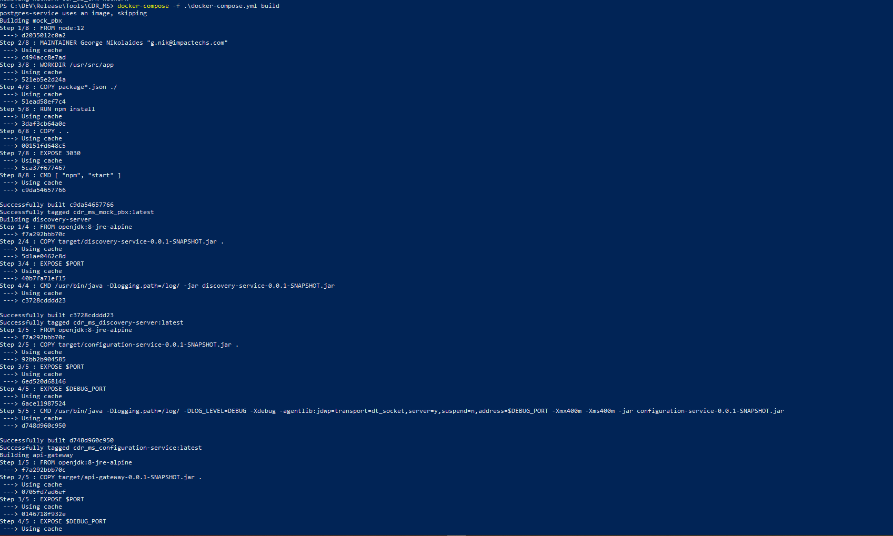
        
      - Once built, run `docker-compose up`
        
        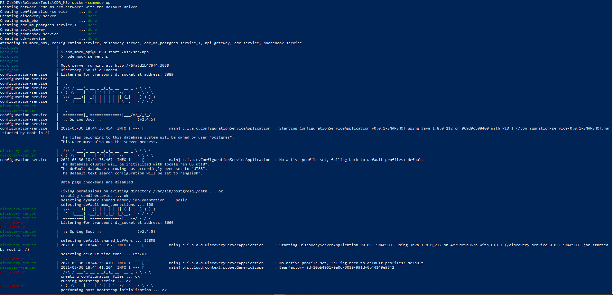
    - Docker cleanup:
        -   `docker-compose down`: This will stop all the running containers.
        -   `docker rmi $(docker images -a -q)`: This will clean all the images created/downloaded for the containers. 
    
High Level Architecture:-
-
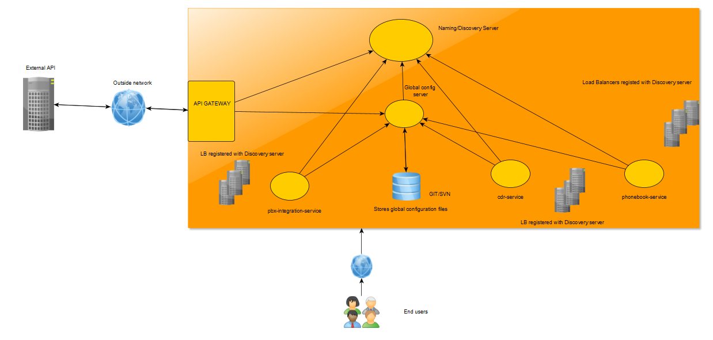

API Gateway is the entry point for the external world to get all the requests. `API Gateway` filters, validates, authorizes the requests and routes to specific server with the help of `Discovery server` using load balancers.  
When routed to specific microservice, its configuration files are stored in git repository monitored by central configuration server for it to be loosely coupled.  

How to run:
-
After all the above micro-services are up and running, verify by hitting eureka server `http://localhost:8671` to see about the services running.

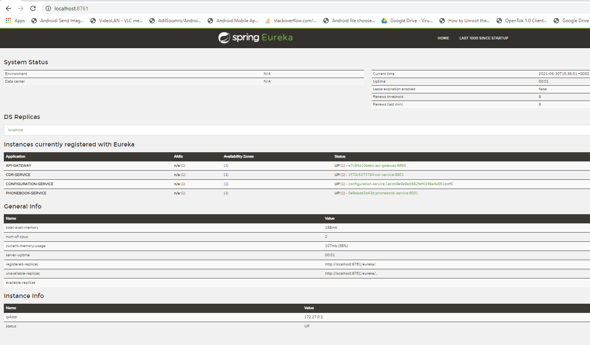

All the microservices' requests/endpoints are called using `api-gateway` url since that is the one determining where the request must go. 
Once verified, you can call below endpoints. 
>Note: Once the services are up, please give few seconds to let them start communicating with each other. Monitor the logs. 

Endpoints/URLs:
-
discovery-server:
-
  - Microservice URL: `http://localhost:8761`

api-gateway:
  - 
  - Microservice URL: `http://localhost:8665`

cdr-service:
  -
  - Swagger/open-api docs: `http://localhost:8901/v2/api-docs`
  - Microservice URL: `http://localhost:8901/cdr`
  - Gateway URL: `http://localhost:8665/cdr-service/cdr`
    - POST `/update_cdr` : triggers the webhook, fetches and updates all the  call data records from PBX API into CRM system
      - Headers example:
        `Accept:application/json
         Content-Type:application/json
         tenant-uuid:418a5c6e-b7e9-46f4-9aa1-08bc9b4970e7`
    - GET /get : fetches all the call data records from CDR API
      - Headers example:
        `Content-Type:application/json
         Accept:application/json
         tenant-uuid:9f486e51-581d-4ee3-8342-320759e62cd8`
        
    - POST `/post` : updates the call data records as list passed in request body to CRM record
      - Request Body example: 
        `[
        {
        "uuid": "34r28759-1635-4c67-a0df-0a2e821bed19",
        "domainName": "mockpbx.impactpbx.com",
        "callerName": "Bettyann Pusateri",
        "callerNumber": 35708970471,
        "destinationNumber": 35702036169,
        "direction": "outbound",
        "callStart": "2021-05-30T20:01:16.000Z",
        "ringStart": "2021-05-30T20:01:17.000Z",
        "answerStart": "2021-05-30T20:01:19.000Z",
        "callEnd": "2021-05-30T20:06:17.000Z",
        "duration": 0,
        "recording": "34r25759-1635-4c67-a0df-0a2e821bed19",
        "clickToCall": false,
        "clickToCallData": "",
        "action": "HANGUP"
        }
        ]`
      - Headers
        `Content-Type:application/json
         Accept:application/json
         tenant-uuid:07a066a7-da67-46c8-b558-31a90b1ae22e`
        
    - PUT `/put`: add single call data record in the system
      - Request Body:
        `{
        "uuid": "34r28759-1635-4c67-a0df-0a2e821bed19",
        "domainName": "mockpbx.impactpbx.com",
        "callerName": "Bettyann Pusateri",
        "callerNumber": 35708970471,
        "destinationNumber": 35702036169,
        "direction": "outbound",
        "callStart": "2021-05-30T20:01:16.000Z",
        "ringStart": "2021-05-30T20:01:17.000Z",
        "answerStart": "2021-05-30T20:01:19.000Z",
        "callEnd": "2021-05-30T20:06:17.000Z",
        "duration": 0,
        "recording": "34r25759-1635-4c67-a0df-0a2e821bed19",
        "clickToCall": false,
        "clickToCallData": "",
        "action": "HANGUP"
        }`
      - Headers
        `Content-Type:application/json
        Accept:application/json
        tenant-uuid:07a066a7-da67-46c8-b558-31a90b1ae22e`
        
    - DELETE `/delete?recording=<call_recording_id>`: deletes the call data record by recording id
      - URL: `/delete?recording=fgdfgcb3-45aa-48d2-b6a8-abe366f5f4fe`
      - Headers
        `tenant-uuid:2877aee8-4fe2-4b1c-9c6d-fdbafd3d448c
        Accept:application/json
        Content-Type:application/json`
    - GET `/report` : fetches detailed report per tenant id passed in the header
      - Headers:
        `Content-Type:application/json
         Accept:application/json
         tenant-uuid:418a5c6e-b7e9-46f4-9aa1-08bc9b4970e7`
    - GET `/reports` : fetches reports for all the tenants
      - Headers: 
        `Content-Type:application/json
        Accept:application/json`
        
 
phonebook-service:
-
  - Swagger/open-api docs: `http://localhost:8501/v2/api-docs`
  - Microservice URL: `http://localhost:8501/phone_book`
  - Gateway URL:  `http://localhost:8665/phonebook-service/phone_book`
    - GET `/records/{caller_number}` : fetches the phone record by caller number
    - GET `/records` : fetches all the records present in the phone book directory
    - POST `/records` : add the list of phone book records into the phone book directory
    - PUT `/records` :  add a single phone record into the phone book directory
    - DELETE  `/records` :  deletes the list of records passed in the request

configuration-service:
-
  - Microservice URL: `http://localhost:8888`

pbx-integration-service:
-
  - Microservice URL: `http://localhost:9901/pbx`
  - Gateway URL: `http://localhost:8665/pbx-integration-service/pbx`
mock-pbx service:
-
    - Microservice URL: `http://localhost:3030` 

Database:
-
  - POSTGRES
    - `cdr-service` MS uses the independent deployed postgres database, as of now. But, same image can be used as a container for different MS as well.
    - Since call data records are managed for multiple tenants, two tables are created with indexing on unique columns for quick searching (keeping it simple, though)
      
        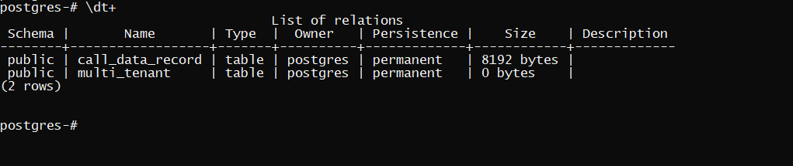

        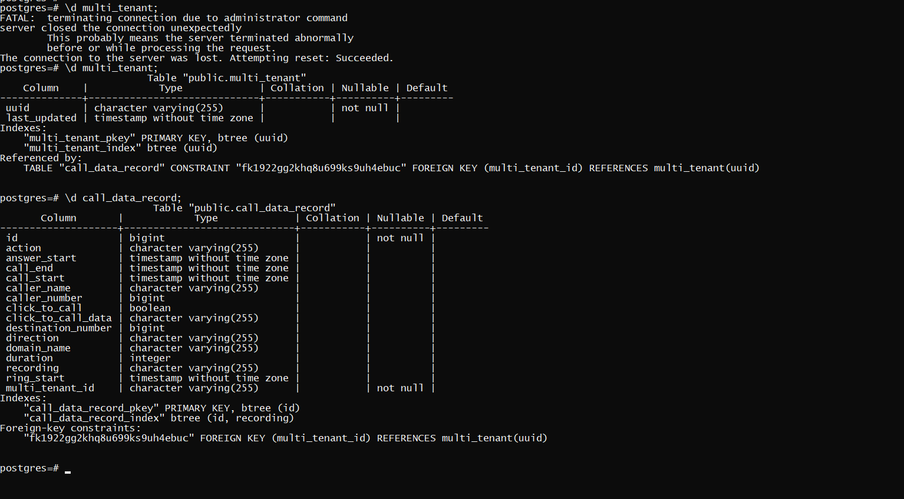
  
Snapshots:
-
Fetching cdr-service api using tenant-uuid

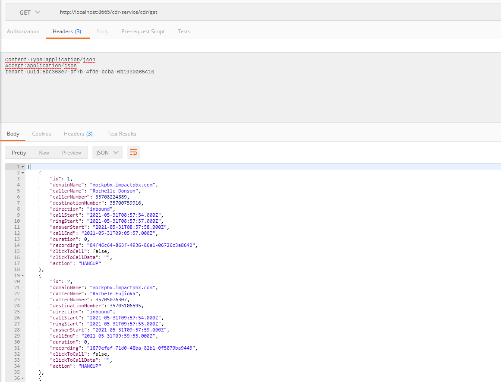

calling pbx-integration-service from cdr-service to trigger webhooks:

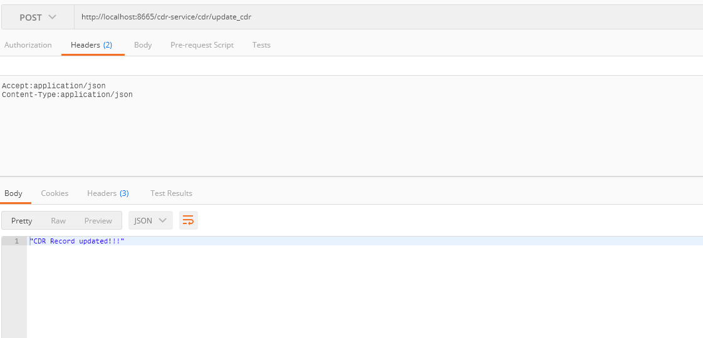

Fetching phonebook records from phonebook-service:

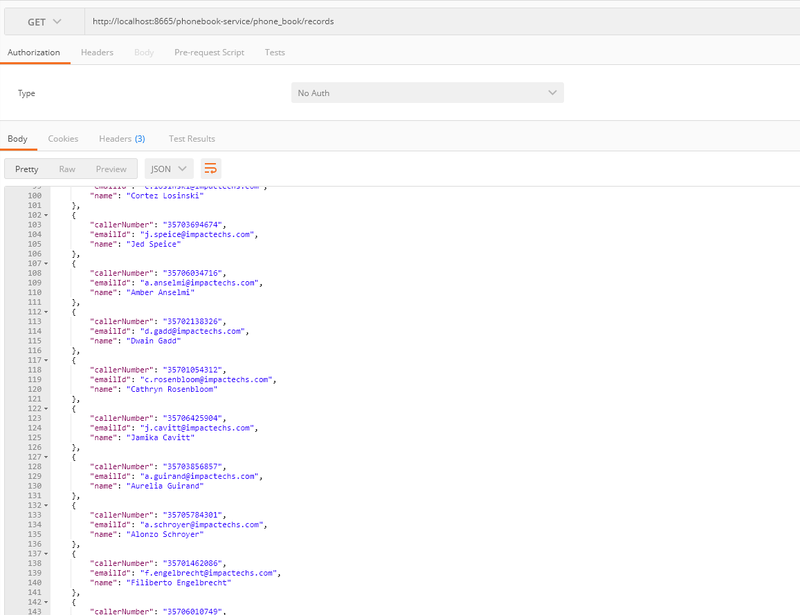

DB record updated:

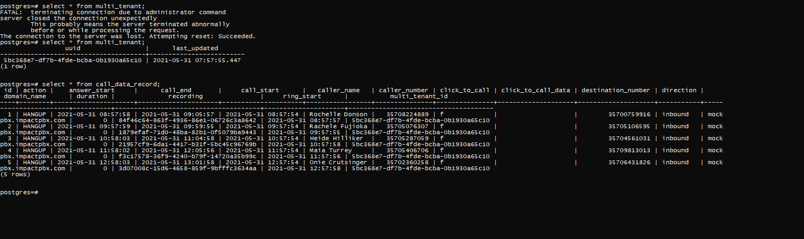

Delete a recording from existing records(5 records) for a tenant (tenant-uuid in header and recording in parameter is required): 
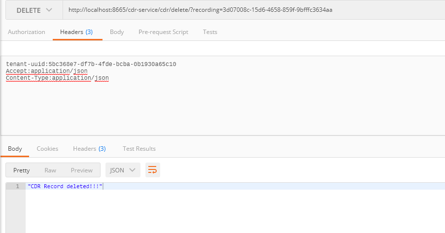

After deletion(4 records): 
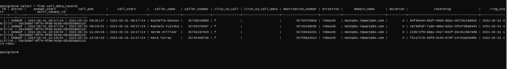

Incorrect tenant-uuid to get report:
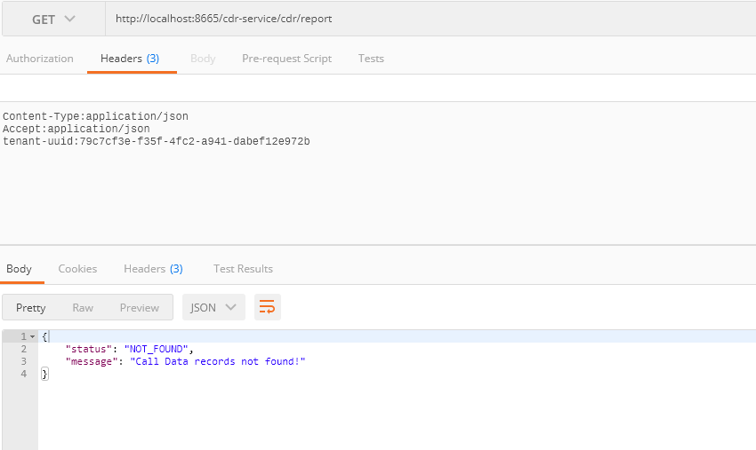

Correct tenant-uuid to get report: 
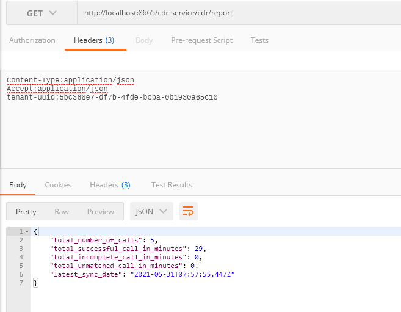

Get reports for all tenanats, (in this case no tenant-uuid is required)
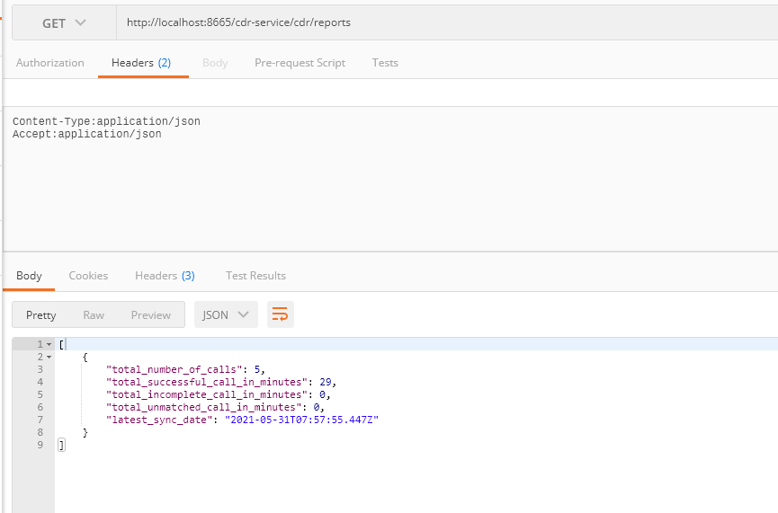

  

